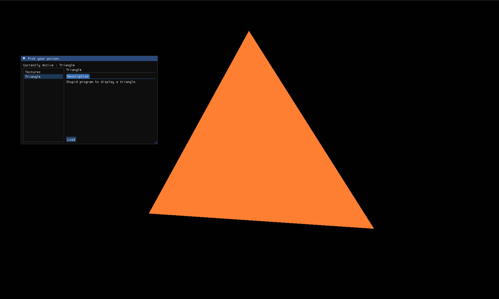

# Graphics-sandbox
A place where I keep track of things to play around with graphics (currently OpenGL only). 
It is a selector of 'scenes' that are different scenarios to play around with.



## TODO
- [ ] Configurables in every scene using Imgui
- [ ] Input system for programs to interact directly
- [ ] Graphics backend abstraction, scenes can use a common interface.
- [ ] Vulkan?
- [ ] Better errors, currently it's just a raw enum that tells us 0 details.
- [ ] Scenes system provided by engine.

## Building
### Pre-requisites
- `CMake >= v3.23`
- `C++23 Compatible Compiler toolchain`
- `Jinja2` : Glad loader Req, needs to be cleaned up.
### Building & Compiling
```
cmake -B ./[build_dir]
cmake --build ./[build_dir] --config [Release/Debug/RelWithDebInfo] -j [jobs]
```
You can also change the generator to Ninja to have parallel build without configuring I suppose.
NOTE: Will provide a much better writeup for setting up soon, currently this will do.
